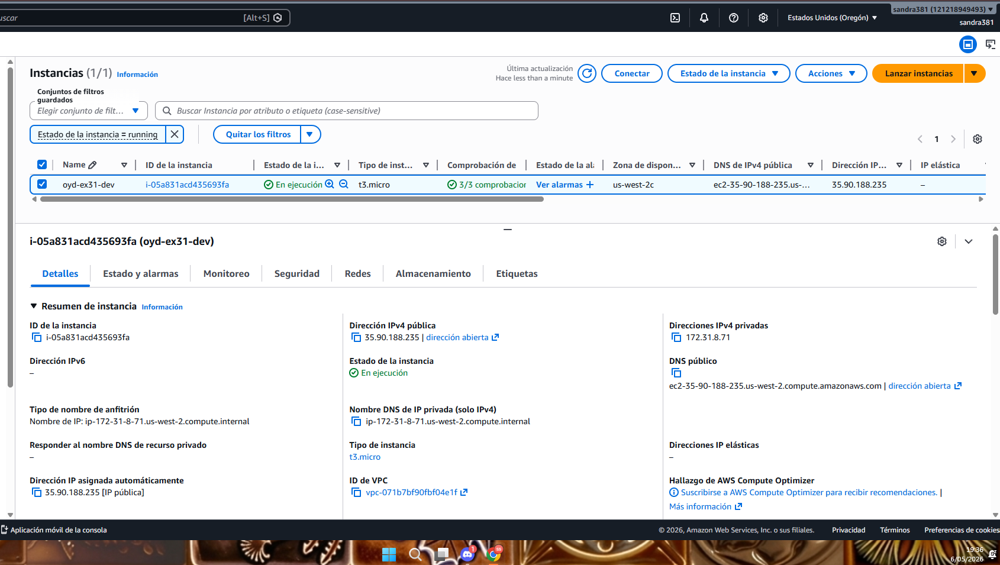
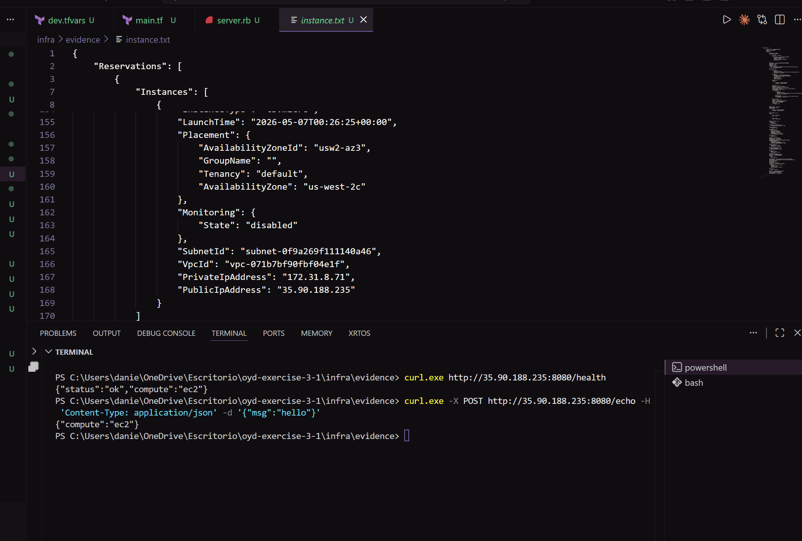

# oyd-exercise-3-1 — EC2 Compute Module

**Curso:** Optimizaciones y Desempeño — Cloud Deployment Automation  
**Integrates:**Gabriela Navarro y Sandra Soria

---

## Descripción

Módulo reutilizable de Terraform que aprovisiona una instancia EC2 en AWS con un servidor HTTP escrito en Ruby. El servidor expone dos endpoints REST y la instancia obtiene el binario desde S3 usando un rol IAM con permisos mínimos.

## Arquitectura

```
Tu IP (allowed_cidr_blocks)
        │
        ▼ puerto 8080
  ┌─────────────┐
  │  EC2 t3.micro│ ← IAM Instance Profile
  │  Ruby :8080  │        │
  └─────────────┘         ▼
                    IAM Role + Policy
                    s3:GetObject → server.rb
                         │
                         ▼
                    S3 Bucket (server.rb)
```

## Estructura del repositorio

```
oyd-exercise-3-1/
├── app/
│   └── server.rb
├── infra/
│   ├── provider.tf
│   ├── variables.tf
│   ├── outputs.tf
│   ├── main.tf
│   ├── envs/
│   │   └── dev/
│   │       └── dev.tfvars
│   ├── modules/
│   │   └── compute_ec2/
│   │       ├── main.tf
│   │       ├── variables.tf
│   │       └── outputs.tf
│   └── evidence/
│       └── instance.txt
├── .github/
│   └── workflows/
│       └── terraform-ci.yml
├── .gitignore
└── README.md
```

## Recursos creados por el módulo

| Recurso | Nombre | Descripción |
|---------|--------|-------------|
| `aws_iam_role` | `oyd-ex31-dev-role` | Rol de EC2 para asumir identidad |
| `aws_iam_role_policy` | `oyd-ex31-dev-s3-read` | Política inline para leer `server.rb` de S3 |
| `aws_iam_instance_profile` | `oyd-ex31-dev-profile` | Perfil que envuelve el rol |
| `aws_security_group` | `oyd-ex31-dev-sg` | Permite TCP 8080 desde tu IP únicamente |
| `aws_instance` | `oyd-ex31-dev` | Instancia EC2 t3.micro con Ruby |

## Despliegue

```bash
# 1. Subir server.rb al bucket S3
aws s3 cp app/server.rb s3://TU_BUCKET/server.rb

# 2. Inicializar y aplicar
cd infra
terraform init
terraform apply -var-file=envs/dev/dev.tfvars

# 3. Destruir al terminar
terraform destroy -var-file=envs/dev/dev.tfvars
```

## Verificación de endpoints


## Evidence

```
-----------------------------------------------------------------
|                     DescribeInstances                         |
+----------------------+---------+------------------+
|  i-05a831acd435693fa | running |  35.90.188.235   |
+----------------------+---------+------------------+
```
[Evidencia de instancia corriendo](infra/evidence/instance.txt)

## CI Pipeline

El pipeline de GitHub Actions se ejecuta en cada Pull Request hacia `main`:

| Paso | Comando | Bloquea PR |
|------|---------|-----------|
| 1 | `terraform fmt --check -recursive` | Sí |
| 2 | `terraform init -backend=false` | Sí |
| 3 | `terraform validate` |  Sí |
| 4 | `terraform plan -var-file=envs/dev/dev.tfvars` |  Sí |
| 5 | Publicar plan como comentario en el PR |  No |

### Secrets requeridos en GitHub

| Secret | Descripción |
|--------|-------------|
| `AWS_ACCESS_KEY_ID` | Access key de AWS |
| `AWS_SECRET_ACCESS_KEY` | Secret key de AWS |
| `AWS_REGION` | Región, ej: `us-west-2` |


